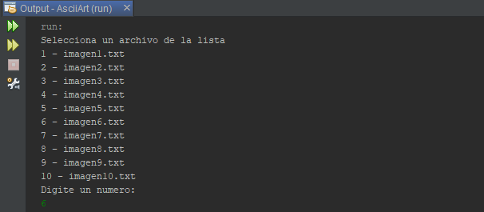
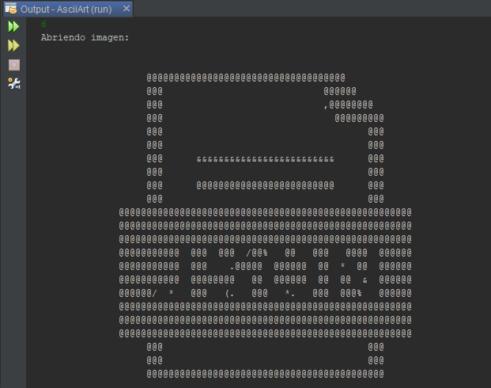
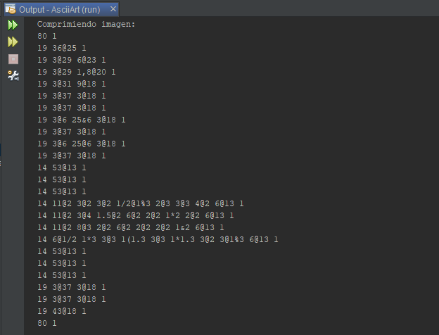
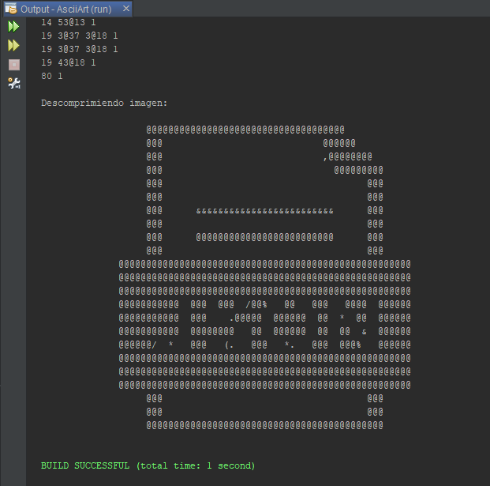

# 💾 RunLength Encoding

> Realiza un programa de compresión de imágenes que utilice el algoritmo “runlength encoding”.

- Descarga o crea al menos 10 imágenes de ASCII Art.

- Cada imagen debe estar contenida en un archivo con extensión \*.art o txt.

- Ya en tu código, la clase AsciiArt será la encargada de leer esos archivos.

Software: Java 8, Netbeans IDE 8.2
